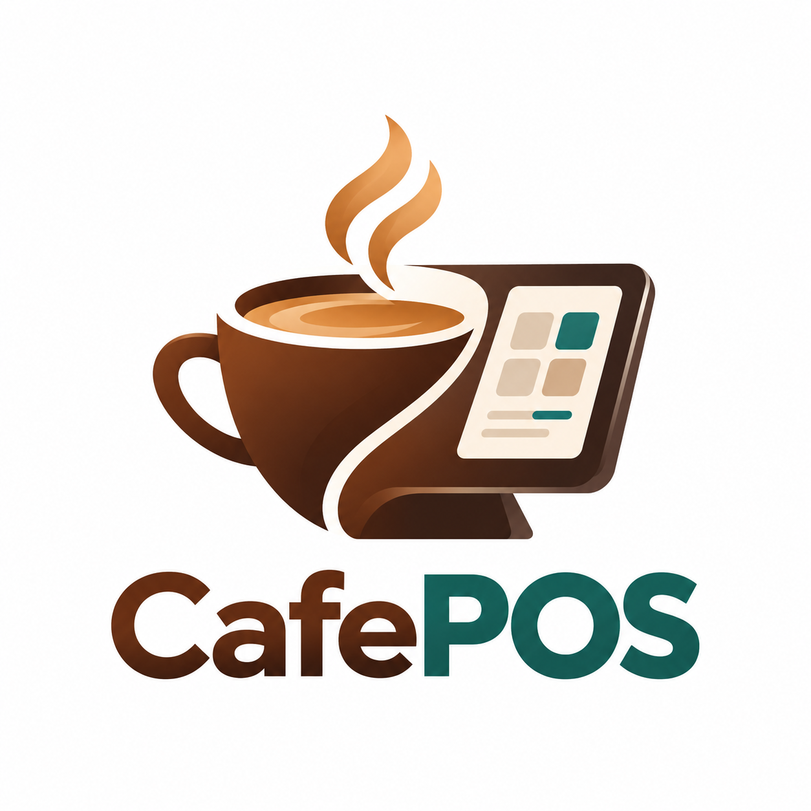
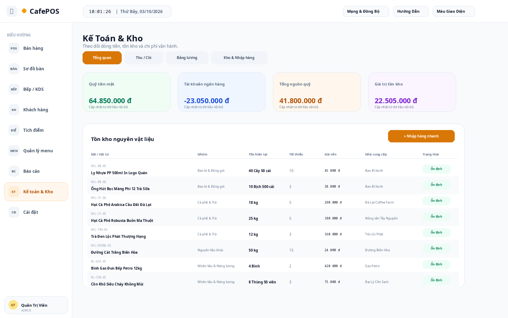
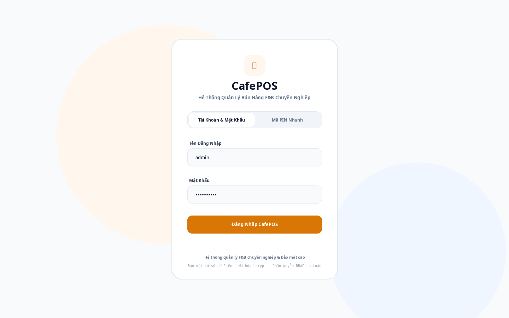

<div align="center">
  <table>
    <tr>
      <td width="110" align="center">
        
      </td>
      <td align="left">
        <h1>☕ CafePOS — Hệ thống quản lý bán hàng cho F&amp;B</h1>
        <p><strong>POS bán hàng · Quản lý bàn · KDS bếp · Kho &amp; kế toán · Báo cáo · Multi-device LAN</strong></p>
      </td>
    </tr>
  </table>
</div>


---

## 📌 Giới thiệu dự án

**CafePOS** là ứng dụng quản lý bán hàng dành cho quán cà phê, trà sữa và các mô hình F&B quy mô nhỏ đến vừa.

Dự án được xây dựng theo mô hình **Server + Client**. Một máy tính tại quán chạy **CafePOS Server**, còn các thiết bị khác như máy POS, laptop, tablet hoặc điện thoại có thể truy cập hệ thống thông qua trình duyệt trong cùng mạng LAN/Wi-Fi.

Dữ liệu của hệ thống được lưu cục bộ bằng SQLite, giúp quán có thể vận hành trong mạng nội bộ mà không phụ thuộc vào Internet. Khi cần truy cập từ xa, launcher của dự án có hỗ trợ **Cloudflare Quick Tunnel**.

---

## 🎯 Mục đích của ứng dụng

CafePOS được phát triển nhằm:

- Số hóa quy trình bán hàng tại quán.
- Giảm việc ghi chép thủ công và hạn chế sai sót khi lên đơn.
- Theo dõi bàn và tình trạng phục vụ theo thời gian thực.
- Chuyển món từ khu vực bán hàng đến bếp/quầy pha chế.
- Quản lý sản phẩm, khách hàng, kho, thu chi và ca làm.
- Hỗ trợ chủ quán theo dõi doanh thu và báo cáo hoạt động.
- Cho phép nhiều thiết bị sử dụng chung một hệ thống qua mạng LAN.
- Tạo nền tảng để tiếp tục phát triển các chức năng quản lý F&B trong tương lai.

---

## ✨ Các hoạt động và chức năng chính

### 🛒 1. Bán hàng / POS

Nhân viên có thể chọn món, thêm món vào đơn hàng, thay đổi số lượng, xử lý tùy chọn món và thực hiện quy trình bán hàng tại quầy.


### 🪑 2. Quản lý bàn

CafePOS hiển thị sơ đồ bàn và trạng thái từng bàn, giúp nhân viên biết bàn nào đang trống, đang phục vụ hoặc đã có đơn hàng.


### 👨‍🍳 3. Bếp / KDS

Màn hình Kitchen Display System giúp bếp hoặc quầy pha chế nhận món, theo dõi các món đang chờ và cập nhật tiến độ xử lý đơn.


### 📦 4. Kho và kế toán

Hệ thống hỗ trợ theo dõi hàng hóa, tồn kho, nhập hàng, thu chi và các số liệu phục vụ quản lý hoạt động kinh doanh.



### 📊 5. Báo cáo

Người quản lý có thể theo dõi doanh thu, đơn hàng, sản phẩm bán ra, hoạt động theo ca và các số liệu tổng hợp khác.

### 👥 6. Khách hàng và thành viên

CafePOS có thể quản lý thông tin khách hàng, lịch sử mua hàng, tích điểm và các cấp độ thành viên.

### 🔐 7. Tài khoản và phân quyền

Hệ thống có đăng nhập và hỗ trợ nhiều vai trò sử dụng như quản trị, thu ngân, phục vụ, bếp và kế toán.



---

# 🚀 Các cách chạy CafePOS

Project hiện tại hỗ trợ nhiều cách chạy tùy nhu cầu: chạy source bằng Node.js, chạy thủ công Node.js + Cloudflare Quick Tunnel mà không cần `.cmd/.bat`, chạy nhanh bằng file `.cmd/.bat`, hoặc dùng bản Server Electron đã đóng gói.

---

## Cách 1 — Chạy Server bằng Node.js / npm

Đây là cách phù hợp khi phát triển, chỉnh sửa source hoặc chạy trực tiếp từ project. CafePOS sử dụng Node.js và quản lý dependencies/scripts bằng npm.

### Yêu cầu

- Windows 10/11 64-bit.
- Node.js 20 hoặc mới hơn.
- npm đi kèm Node.js.

Kiểm tra Node.js:

```bash
node -v
npm -v
```

### Bước 1 — Mở terminal tại thư mục project

Ví dụ:

```text
POS OS/
```

### Bước 2 — Cài dependencies

```bash
npm install
```

Nếu project đã có thư mục `node_modules` đầy đủ thì có thể bỏ qua bước này.

### Bước 3 — Khởi động server

Chạy chế độ development:

```bash
npm run dev
```

Hoặc:

```bash
npm start
```

Trong `package.json` của project, cả hai lệnh trên đều khởi động:

```text
tsx server.ts
```

Vì vậy khi sử dụng bình thường, nên chạy qua **npm** (`npm run dev` hoặc `npm start`) thay vì gọi `tsx` trực tiếp.

Server mặc định sử dụng cổng:

```text
3000
```

Sau khi server chạy, mở trên chính máy chủ:

```text
http://localhost:3000
```

---

## Cách 2 — Chạy bằng npm + Cloudflare Quick Tunnel (không dùng `.bat/.cmd`)

Đây là cách khuyến nghị khi muốn chạy CafePOS trực tiếp từ source mà không sử dụng `START_SERVER.cmd` hoặc `LAUNCH_SERVER.bat`.

CafePOS là project Node.js và được quản lý bằng **npm**. Vì vậy luồng chạy chuẩn là:

```text
npm install
npm run dev
```

hoặc:

```text
npm install
npm start
```

Cloudflare Quick Tunnel chỉ là bước tùy chọn nếu cần truy cập CafePOS từ Internet.

### Yêu cầu

- Windows 10/11 64-bit.
- Node.js 20 hoặc mới hơn.
- npm đi kèm Node.js.
- `cloudflared` nếu cần truy cập từ xa qua `trycloudflare.com`.

Kiểm tra Node.js và npm:

```bash
node -v
npm -v
```

### Bước 1 — Mở Terminal tại thư mục project

Mở PowerShell, CMD hoặc Windows Terminal tại thư mục chứa `package.json`.

Ví dụ:

```powershell
cd "D:\CODE\POS OS"
```

Thay đường dẫn trên bằng thư mục thực tế của CafePOS.

### Bước 2 — Cài dependencies bằng npm

Ở lần chạy đầu tiên, chạy:

```bash
npm install
```

Lệnh này đọc `package.json` và cài các package cần thiết vào thư mục:

```text
node_modules/
```

Thông thường chỉ cần chạy lại `npm install` khi:

- Mới tải/copy project sang máy khác.
- Xóa thư mục `node_modules`.
- `package.json` hoặc dependencies thay đổi.
- npm báo thiếu module/package.

### Bước 3 — Chuẩn bị file `.env`

Nếu project chưa có `.env`, tạo từ `.env.example`.

PowerShell:

```powershell
Copy-Item .env.example .env
```

CMD:

```cmd
copy .env.example .env
```

Nếu `.env` đã tồn tại thì bỏ qua bước này.

### Bước 4 — Chạy CafePOS bằng npm

Chế độ development:

```bash
npm run dev
```

Hoặc:

```bash
npm start
```

Trong cấu hình hiện tại của project, các npm script này khởi động backend từ:

```text
tsx server.ts
```

Người dùng **không cần chạy `tsx` hoặc `npx tsx` thủ công**; nên chạy thông qua npm để đúng với cấu hình trong `package.json`.

Giữ cửa sổ Terminal này mở trong suốt thời gian sử dụng CafePOS.

### Bước 5 — Kiểm tra Server

Trên chính máy Server, mở:

```text
http://localhost:3000
```

Nếu giao diện CafePOS xuất hiện thì Server đã chạy thành công.

Port mặc định:

```text
3000
```

### Bước 6 — Truy cập từ máy khác trong LAN/Wi-Fi

Trên máy Server, kiểm tra IPv4:

```cmd
ipconfig
```

Ví dụ IP máy Server là:

```text
192.168.1.5
```

thì máy POS, laptop, tablet, điện thoại hoặc máy bếp cùng mạng truy cập:

```text
http://192.168.1.5:3000
```

Nếu Client không truy cập được:

- Kiểm tra CafePOS Server vẫn đang chạy.
- Kiểm tra Server và Client cùng mạng LAN/Wi-Fi.
- Kiểm tra đúng IPv4 của máy Server.
- Cho phép Node.js/CafePOS qua Windows Firewall trên **Private networks**.
- Không dùng `localhost:3000` trên máy Client.

### Bước 7 — Cài Cloudflare `cloudflared` nếu cần truy cập Internet

Bước này **không bắt buộc** nếu chỉ dùng CafePOS trong mạng LAN.

Nếu muốn tạo URL dạng:

```text
https://xxxxx.trycloudflare.com
```

thì cần cài `cloudflared`.

Có thể cài `cloudflared` vào Windows PATH hoặc đặt `cloudflared.exe` ngay trong thư mục project.

Kiểm tra nếu đã có trong PATH:

```bash
cloudflared --version
```

Nếu `cloudflared.exe` nằm trong thư mục project:

```powershell
.\cloudflared.exe --version
```

### Bước 8 — Chạy Cloudflare Quick Tunnel

Trước tiên phải đảm bảo CafePOS đang chạy bằng npm:

```bash
npm run dev
```

Sau đó **giữ nguyên Terminal này** và mở một Terminal thứ hai.

Nếu `cloudflared` đã có trong PATH:

```bash
cloudflared tunnel --url http://localhost:3000
```

Nếu `cloudflared.exe` nằm ngay trong thư mục project:

```powershell
.\cloudflared.exe tunnel --url http://localhost:3000
```

Sau khi kết nối thành công, Cloudflare sẽ hiển thị URL dạng:

```text
https://xxxxx.trycloudflare.com
```

Có thể mở URL này trên thiết bị ở ngoài mạng LAN để truy cập CafePOS.

> **Lưu ý:** Quick Tunnel là tunnel tạm thời. Khi đóng tiến trình `cloudflared`, URL `trycloudflare.com` hiện tại sẽ ngừng hoạt động. Lần chạy sau có thể sinh URL khác.

> **Bảo mật:** URL `trycloudflare.com` có thể truy cập từ Internet. Chỉ chia sẻ cho người được phép sử dụng hệ thống.

### Tóm tắt cách chạy không dùng BAT/CMD

Lần đầu trên máy mới:

```bash
npm install
```

Mỗi lần chạy CafePOS:

**Terminal 1 — CafePOS Server**

```bash
npm run dev
```

hoặc:

```bash
npm start
```

**Terminal 2 — Chỉ mở khi cần Cloudflare**

```bash
cloudflared tunnel --url http://localhost:3000
```

Sau đó truy cập:

```text
Trên máy Server:       http://localhost:3000
Trong mạng LAN:        http://<IP-MAY-SERVER>:3000
Qua Internet:          https://xxxxx.trycloudflare.com
```

### Các lệnh npm chính

```bash
npm install       # Cài dependencies
npm run dev       # Chạy CafePOS ở chế độ development
npm start         # Chạy CafePOS bằng script start
```

Không cần chạy trực tiếp:

```text
node server.ts
npx tsx server.ts
```

trong quy trình sử dụng thông thường, vì việc khởi động đã được định nghĩa trong npm scripts của project.

---

## Cách 3 — Chạy nhanh bằng `START_SERVER.cmd`

Đây là cách thuận tiện nhất khi chạy project trên Windows mà không muốn gõ lệnh thủ công.

Tại thư mục gốc của project, click đúp:

```text
START_SERVER.cmd
```

File này gọi tiếp:

```text
LAUNCH_SERVER.bat
```

### `LAUNCH_SERVER.bat` tự động làm gì?

Launcher của project sẽ tự động:

1. Kiểm tra Node.js.
2. Kiểm tra npm.
3. Kiểm tra thư mục `node_modules`.
4. Nếu thiếu dependencies, tự chạy `npm install`.
5. Tạo thư mục dữ liệu cần thiết.
6. Tạo `.env` từ `.env.example` nếu chưa có.
7. Phát hiện IP Wi-Fi/Ethernet của máy chủ.
8. Kiểm tra và giải phóng port `3000` nếu cần.
9. Chạy CafePOS Backend bằng `npm run dev`.
10. Chờ server sẵn sàng tại `http://localhost:3000`.
11. Tìm hoặc tải `cloudflared.exe` nếu cần dùng Quick Tunnel.
12. Hiển thị địa chỉ Local/LAN và tự mở CafePOS bằng trình duyệt.

Vì vậy với máy Windows đã cài Node.js, thông thường chỉ cần:

```text
Click START_SERVER.cmd
```

là có thể chạy hệ thống.

> `START_SERVER.cmd` là file gọi launcher chính. Nếu cần xem đầy đủ log hoặc chạy trực tiếp launcher, có thể click `LAUNCH_SERVER.bat`.

---

## Cách 4 — Chạy bằng bản POS OS Server Electron

Trong project có thư mục:

```text
server-app/
```

Đây là ứng dụng Electron dùng để đóng gói CafePOS Server thành chương trình Windows.

Bản build hiện có nằm tại:

```text
server-app/dist-build/POS OS Server-win32-x64/
```

File chạy chính:

```text
POS OS Server.exe
```

### Cách sử dụng bản đóng gói

1. Mở thư mục `POS OS Server-win32-x64`.
2. Chạy:

```text
POS OS Server.exe
```

3. Giao diện Server Launcher sẽ khởi động server.
4. Chờ trạng thái server chuyển sang hoạt động.
5. Mở địa chỉ Local hoặc LAN được hiển thị trong launcher.

Bản này phù hợp khi phân phối cho người dùng vì server, frontend và môi trường Electron đã được đóng gói cùng nhau.

### Build lại bản Server Windows

Trong thư mục:

```text
server-app/
```

chạy:

```text
build.bat
```

Script build sẽ:

1. Build frontend React.
2. Bundle Express backend.
3. Copy các thành phần SQLite/sql.js và dữ liệu cần thiết.
4. Đóng gói Electron app.
5. Tạo file ZIP phát hành.

Kết quả được tạo trong:

```text
server-app/dist-build/
```

với file ZIP dạng:

```text
POS-OS-Server-v1.0.0-win64.zip
```

> **Lưu ý:** `server-app/start.bat` trong source hiện chứa đường dẫn tuyệt đối của máy phát triển (`d:\CODE\POS OS\...`). File này chỉ phù hợp cho môi trường dev ban đầu. Khi phát hành cho người dùng, nên chạy **`POS OS Server.exe`** thay vì phụ thuộc vào `start.bat`.

---

# 💻 Cách chạy Client

Trong bản project hiện tại, **Client không phải là một server Node.js riêng** và cũng không có thư mục `client-app` độc lập trong file ZIP đã cung cấp.

Frontend React được Server phục vụ trực tiếp. Vì vậy các máy Client chỉ cần có trình duyệt như Chrome, Edge, Safari hoặc trình duyệt tương thích.

## Client trên chính máy Server

Mở:

```text
http://localhost:3000
```

## Client trên máy khác cùng Wi-Fi/LAN

Giả sử máy Server có IP:

```text
192.168.1.5
```

thì các Client truy cập:

```text
http://192.168.1.5:3000
```

Có thể sử dụng URL này trên:

- Máy POS khác.
- Laptop.
- Tablet.
- iPad.
- Điện thoại Android/iPhone.
- Máy tại khu vực bếp.

### Điều kiện để Client kết nối được

- Server và Client phải cùng mạng LAN/Wi-Fi.
- CafePOS Server phải đang chạy.
- Không được đóng cửa sổ server nếu đang chạy bằng Node.js.
- Windows Firewall cần cho phép Node.js/CafePOS Server truy cập mạng riêng nếu hệ thống hỏi quyền.
- Client phải truy cập đúng địa chỉ IP của máy Server và đúng port `3000`.

### Ví dụ mô hình sử dụng

```text
                     ┌──────────────────────────┐
                     │      MÁY SERVER POS      │
                     │   CafePOS Node/Electron  │
                     │     192.168.1.5:3000     │
                     └────────────┬─────────────┘
                                  │
                         LAN / Wi-Fi nội bộ
               ┌──────────────────┼──────────────────┐
               │                  │                  │
        ┌──────▼──────┐    ┌──────▼──────┐    ┌──────▼──────┐
        │ Thu ngân/POS│    │ Tablet phục │    │  Bếp / KDS  │
        │   Browser   │    │ vụ - Browser│    │   Browser   │
        └─────────────┘    └─────────────┘    └─────────────┘
```

---

## 👨‍🍳 Client dành cho Bếp / KDS

Trên máy hoặc tablet đặt tại bếp:

1. Kết nối cùng Wi-Fi/LAN với Server.
2. Mở trình duyệt.
3. Truy cập URL của Server, ví dụ:

```text
http://192.168.1.5:3000
```

4. Đăng nhập bằng tài khoản có quyền bếp.
5. Mở khu vực **Bếp / KDS**.

Khi POS tạo hoặc cập nhật đơn, server sử dụng cơ chế realtime để các thiết bị đang kết nối nhận thay đổi.

---

## 🖥️ Màn hình Kiosk

Project có route Kiosk riêng.

Trên máy Server:

```text
http://localhost:3000/kiosk
```

Trên Client cùng mạng:

```text
http://192.168.1.5:3000/kiosk
```

Thay `192.168.1.5` bằng IP thực tế của máy Server.

---

## ☁️ Client truy cập từ xa bằng Cloudflare Tunnel

`LAUNCH_SERVER.bat` có hỗ trợ **Cloudflare Quick Tunnel**.

Nếu Cloudflare Tunnel khởi động thành công, launcher sẽ cung cấp một URL HTTPS dạng:

```text
https://xxxxx.trycloudflare.com
```

Client ở ngoài mạng LAN có thể mở URL đó bằng trình duyệt để truy cập hệ thống.

> Cloudflare Tunnel là tính năng tùy chọn. CafePOS vẫn có thể hoạt động bình thường trong mạng LAN mà không cần Internet.

---

# 🧭 Hướng dẫn sử dụng cơ bản

## 1. Khởi động máy Server

Nếu chạy source bằng Node.js/npm, dùng:

```bash
npm run dev
```

hoặc:

```bash
npm start
```

Nếu muốn dùng launcher Windows thì chạy:

```text
START_SERVER.cmd
```

hoặc chạy bản đóng gói:

```text
POS OS Server.exe
```

Nếu chạy Node.js thủ công và cần truy cập từ Internet, mở Terminal thứ hai:

```bash
cloudflared tunnel --url http://localhost:3000
```

## 2. Kết nối các Client

Trên các máy khác, mở địa chỉ LAN được Server hiển thị, ví dụ:

```text
http://192.168.1.5:3000
```

## 3. Đăng nhập

Nhập tài khoản/PIN theo tài khoản đã được tạo trong hệ thống và truy cập module phù hợp với vai trò.

## 4. Bán hàng

1. Vào POS.
2. Chọn bàn hoặc tạo đơn.
3. Chọn món.
4. Kiểm tra số lượng và tùy chọn.
5. Gửi/xác nhận đơn.
6. Theo dõi món tại bếp.
7. Thanh toán và hoàn tất đơn.

## 5. Bếp xử lý món

1. Mở KDS trên máy bếp.
2. Xem đơn mới.
3. Chế biến món.
4. Cập nhật trạng thái món.

## 6. Quản lý cuối ngày

Người quản lý có thể kiểm tra:

- Doanh thu.
- Đơn hàng.
- Ca làm.
- Thu chi.
- Tồn kho.
- Báo cáo hoạt động.

---

# 🔧 Xử lý lỗi kết nối Client

Nếu máy Server mở được CafePOS nhưng Client không truy cập được, kiểm tra lần lượt:

### 1. Kiểm tra Server còn chạy

Trên máy Server mở:

```text
http://localhost:3000
```

Nếu Local không mở được thì cần khởi động lại Server trước.

### 2. Kiểm tra IP Server

Có thể xem IP do `LAUNCH_SERVER.bat` hiển thị hoặc dùng:

```cmd
ipconfig
```

Tìm địa chỉ IPv4 của Wi-Fi/Ethernet, ví dụ:

```text
192.168.1.5
```

### 3. Kiểm tra cùng mạng

Server và Client phải ở cùng router/Wi-Fi nếu đang sử dụng chế độ LAN.

### 4. Kiểm tra Firewall

Nếu Windows hỏi quyền cho Node.js hoặc CafePOS Server, cho phép kết nối trên **Private networks**.

### 5. Kiểm tra đúng URL

Client không dùng:

```text
http://localhost:3000
```

vì `localhost` trên Client chính là thiết bị Client đó.

Client phải dùng IP của **máy Server**, ví dụ:

```text
http://192.168.1.5:3000
```

---

## 📁 Cấu trúc liên quan đến chạy Server

```text
POS OS/
├── server.ts                  # Entry point Node.js/Express
├── package.json               # npm scripts và dependencies
├── .env                       # Cấu hình môi trường
├── .env.example
├── START_SERVER.cmd           # Chạy nhanh trên Windows
├── LAUNCH_SERVER.bat          # Launcher đầy đủ Local/LAN/Cloudflare
├── cloudflared.exe            # Tùy chọn: chạy Quick Tunnel thủ công trên Windows
├── data/
│   └── cafepos.db             # Database
├── dist/                      # Frontend đã build
├── server/                    # Backend routes/modules
├── src/                       # Frontend React
└── server-app/
    ├── main.js                # Electron Server Launcher
    ├── build-server.js
    ├── build.bat              # Build bản Windows
    ├── start.bat              # Dev launcher cũ, có đường dẫn cứng
    └── dist-build/
        └── POS OS Server-win32-x64/
            └── POS OS Server.exe
```

---

## 🌐 CafePOS Website

**CafePOS Website** là trang giới thiệu sản phẩm, dùng để:

- Giới thiệu dự án.
- Trình bày các chức năng chính.
- Hiển thị screenshot của ứng dụng.
- Cho người dùng xem trước giao diện.
- Cung cấp hướng dẫn và khu vực tải bản phát hành.

Các screenshot trong README được lưu tại:

```text
screenshots/
```

```text
screenshots/
├── 01-login.png
├── 02-table-map.png
├── 03-pos.png
├── 04-kitchen.png
└── 05-accounting.png
```

---

## 👨‍💻 Tác giả

**Triết Võ**

- GitHub: `trietpko2002`
- Dự án: **CafePOS / POS OS**
- Repository: `Cafe-Pos-Node.js`

CafePOS được phát triển với mục tiêu xây dựng một giải pháp quản lý bán hàng dễ tiếp cận cho quán cà phê và mô hình F&B, đồng thời phục vụ quá trình nghiên cứu, học tập và phát triển một hệ thống Server + Client thực tế.

---

## 📄 Ghi chú

- Port mặc định của CafePOS Server là `3000`.
- Project sử dụng npm để cài dependencies và chạy các script Node.js. Trên máy mới, chạy `npm install` trước khi `npm run dev` hoặc `npm start`.
- Database của project nằm trong thư mục `data/` khi chạy source; bản Electron có vùng dữ liệu riêng của ứng dụng.
- Không nên mở hai Server CafePOS cùng lúc trên cùng port `3000`.
- IP LAN có thể thay đổi sau khi router hoặc máy Server khởi động lại. Nếu Client mất kết nối, hãy kiểm tra lại IP Server.
- Nếu chạy Cloudflare Quick Tunnel thủ công, phải giữ cả tiến trình Node.js và `cloudflared` hoạt động.
- URL `trycloudflare.com` là URL tạm thời và có thể thay đổi sau mỗi lần khởi động lại tunnel.
- Nội dung và cấu trúc có thể tiếp tục thay đổi ở các phiên bản sau.

---

<p align="center">
  <b>CafePOS — Server chạy một nơi, nhiều thiết bị cùng phục vụ.</b>
</p>
